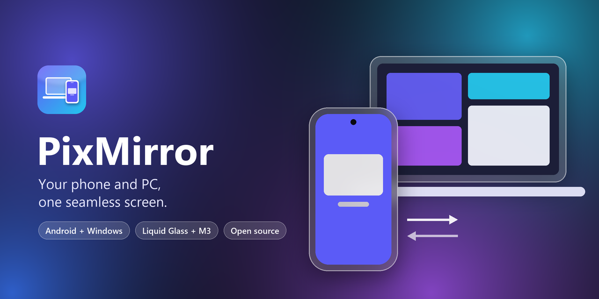
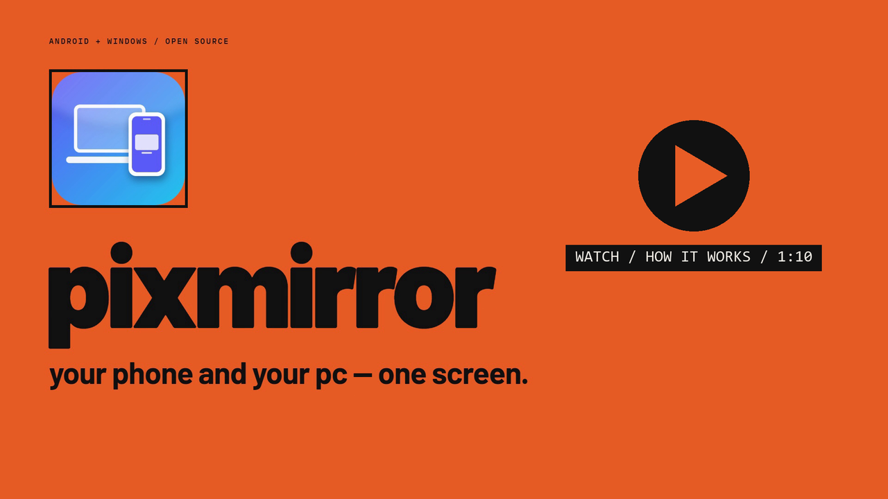
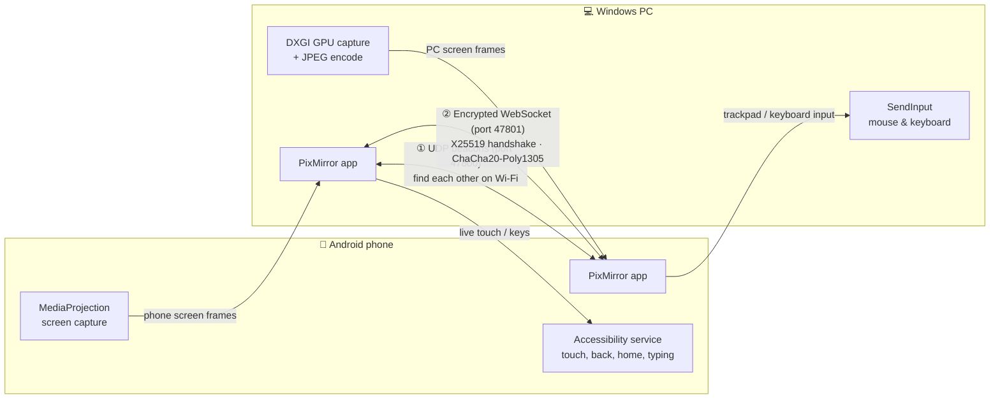
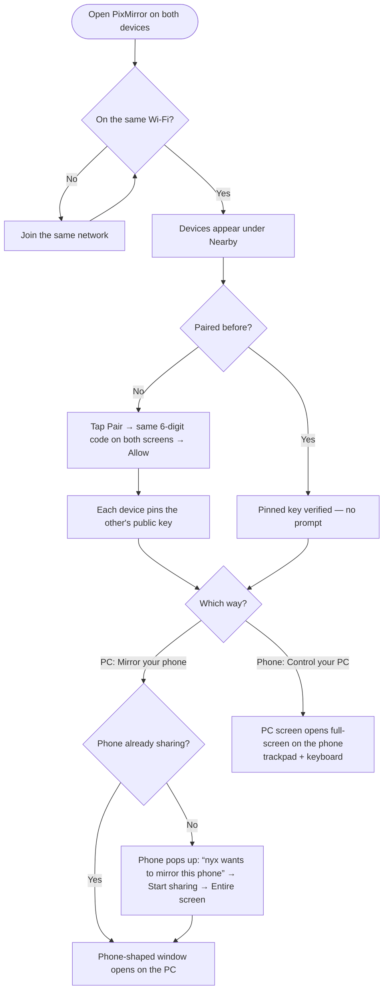
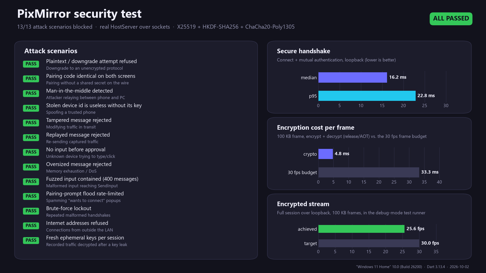

<p align="center">
  
</p>

<p align="center">
  <a href="https://github.com/nyxri0f8/pixmirror/releases/latest"></a>
  
  
  <a href="SECURITY.md"></a>
  <a href="#license"></a>
</p>

## ▶ Watch: how it works (70 s)

<p align="center">
  <a href="https://github.com/nyxri0f8/pixmirror/blob/main/docs/pixmirror-how-it-works.mp4">
    
  </a>
</p>

<p align="center"><sub>Click to play · <a href="https://github.com/nyxri0f8/pixmirror/raw/main/docs/pixmirror-how-it-works.mp4">download MP4</a></sub></p>

**PixMirror** brings the iPhone-Mirroring experience to **Android and Windows**, and it works in **both directions**:

- 📱➡️💻 **Mirror your phone on your PC.** A phone-shaped window with your phone's real dimensions, corner radius and camera cutout. Click to tap, drag to swipe, scroll to scroll, type with your keyboard.
- 💻➡️📱 **Control your PC from your phone.** Use the phone as a laptop trackpad and keyboard, with pinch-to-zoom, shortcuts and multi-monitor support.
- ✨ **Seamless, like Apple's devices.**
  - Devices find each other on Wi-Fi automatically.
  - Pairing happens once, with a 6-digit code.
  - A "nearby" popup lets you connect with one click.
  - Clicking **Mirror** on the PC makes your phone ask to start sharing.

The interface blends Apple's **Liquid Glass** with Google's **Material 3 Expressive**:
- Frosted, light-catching glass is used only for controls.
- Colors come from your wallpaper or Windows accent color.
- Motion uses M3's spring-physics tokens.
- *Reduce Transparency* is supported.

---

## Download

Grab the latest build from **[Releases](https://github.com/nyxri0f8/pixmirror/releases/latest)**:

| Platform | File |
|---|---|
| Windows 10/11 (x64) | `PixMirror-1.1.1-windows-x64.zip`: unzip anywhere and run `pixmirror.exe` |
| Android (most phones) | `PixMirror-1.1.1-android-arm64.apk` |
| Android (older 32-bit phones) | `PixMirror-1.1.1-android-armv7.apk` |
| Android emulator / x86 | `PixMirror-1.1.1-android-x86_64.apk` |

## How it works



### Connecting, step by step



### Under the hood

- **Security.** Every connection is encrypted and mutually authenticated (X25519 + HKDF-SHA256 + ChaCha20-Poly1305), and pairing compares a code derived from the handshake, so no secret ever crosses the network. See [Security](#security).
- **Discovery.** Every device broadcasts a small JSON beacon every 1.5 s and answers beacons it hears directly, so devices find each other even when a phone or router drops broadcasts.
- **Pairing and trust.** The first connection shows a 6-digit code on both screens, derived from the encrypted handshake. Once you approve, each side pins the other's public key. Later connections are checked against it, so trusted devices connect instantly in either direction, and impostors are refused.
- **Video.**
  - The PC captures with DXGI Desktop Duplication, which is GPU-based and only produces a frame when the screen changes, then encodes with WIC.
  - The phone captures with MediaProjection.
  - Frames are JPEG. At most two are in flight at once, and each is acknowledged, so the picture never lags behind.
- **Input.**
  - The PC injects input with `SendInput`.
  - The phone uses an Accessibility service with *continued gesture strokes*, so a remote finger can stay down and follow the mouse live.

## Set up

### Windows

1. Run `pixmirror.exe`. When Windows Firewall asks, allow PixMirror on **private networks**.
2. Closing the window keeps PixMirror in the **tray**, so your phone can always find the PC. Quit from the tray icon.

### Android

The app walks you through this on first launch. You can reopen the guide anytime from **Settings → Setup guide**.

1. **Install the APK.** If Android blocks it, allow *Install unknown apps* for your browser or file manager.
2. **Allow restricted settings** (Android 13+, needed only for apps installed from a file):
   1. Open **Settings → Accessibility** and try to turn on *PixMirror remote control* once. Android will say it's restricted.
   2. Go to **Settings → Apps → PixMirror**, tap **⋮** (top right), then **Allow restricted settings**, and confirm with your PIN.
3. **Turn on remote control:** go to **Settings → Accessibility → Downloaded apps → PixMirror remote control → On**. This lets your PC tap, swipe and type on the phone. PixMirror only acts on input from devices you paired.
4. **Allow notifications.** Your PC can then ask to mirror the phone even while PixMirror is in the background.
5. *(Optional)* Set **battery → Unrestricted** for PixMirror so Android doesn't freeze it.

> **Developer options are not needed** to use PixMirror. No USB debugging and no ADB.

### Gestures: controlling the PC from the phone

| Gesture | Action |
|---|---|
| Drag one finger | Move the pointer |
| Tap | Click |
| Double tap | Double click |
| Tap, then touch and drag | Click-and-drag (select text, move windows) |
| Two-finger tap | Right click |
| Two-finger drag | Scroll |
| Pinch | Zoom the view (the pointer stays in view) |

Switch to **Touch mode** in the toolbar to tap exactly where you touch; in touch mode, long-press is a right click. Use **⌘ Shortcuts** for Copy, Paste, Alt+Tab, Task view, Task Manager, media keys and more.

### Mirroring the phone on the PC

| On the PC | On the phone |
|---|---|
| Click | Tap |
| Click and drag | Swipe or drag (live) |
| Mouse wheel | Scroll |
| Right click | Back |
| Middle click | Home |
| Type on the keyboard | Types into the focused field |

## Build from source

You need:
- Flutter 3.47+
- For Windows: Visual Studio 2022 Build Tools with *Desktop development with C++*
- For Android: the Android SDK

> **Windows Developer Mode is required to build.** Flutter needs symlinks for plugins: go to **Settings → System → For developers → Developer Mode → On**.

```bash
flutter pub get
flutter build windows --release
flutter build apk --release --split-per-abi
```

The banner is rendered by `tools/make_banner.py`.

### Project layout

```
lib/
  core/        protocol, discovery, store (identity, trust, prefs), host_server, remote_session
  platform/    ScreenHost interface · WindowsHost (FFI) · AndroidHost (method channels)
  ui/          Material 3 theme, M3 Expressive spring tokens, Liquid Glass widgets, aurora backdrop
  screens/     splash, setup guide, home, viewer (phone frame + trackpad), shortcuts, settings
  widgets/     glass panels, nearby banner, pairing / share / connect popups
  desktop/     tray, close-to-tray, toasts, frameless title bar
windows/runner/pixmirror_native.cpp        DXGI capture (+GDI fallback), WIC JPEG, SendInput
android/app/src/main/kotlin/.../
  CaptureService.kt    MediaProjection foreground service (pull-based frames)
  InputService.kt      AccessibilityService: live touch, global actions, text
  PresenceService.kt   keeps the phone discoverable in the background
  ScreenInfo.kt        real screen size, corner radius and cutouts
```

## Security

<p align="center">
  
</p>

- **End-to-end encryption.** Every frame and every input is encrypted with ChaCha20-Poly1305.
- **Mutual authentication.** Both devices prove their identity with X25519 identity keys, and every session uses fresh keys (forward secrecy).
- **MITM-proof pairing.** The 6-digit code comes from the handshake. An attacker in the middle makes the two screens show different codes.
- **Hardened host:**
  - LAN-only connections
  - rate limits and lockout
  - message size limits
  - strict input validation before anything reaches the OS

The suite in [`test/security_test.dart`](test/security_test.dart) runs **20 security tests**. They include:
- pairing brute-force, MITM, replay, tampering, malformed and oversized packets
- authentication bypass, protocol downgrade, key pinning, session isolation, disconnect/reconnect and forward secrecy
- discovery privacy, port exposure, Android Accessibility and Windows `SendInput` authorization, and clipboard leakage
- parser fuzzing, dependency and secret scanning, and an end-to-end regression

It also benchmarks the encryption. See **[SECURITY.md](SECURITY.md)** for the full design, threat model and how to report a vulnerability.

## Known limitations

- Windows doesn't allow injected input into apps running **as administrator**, or on the lock/UAC screen.
- Android asks for screen-capture consent each time sharing starts. This is an Android 14+ rule.
- Video is JPEG frames. Hardware H.264 is the next step for higher frame rates.
- 1.1 uses a new encrypted protocol, so devices on 1.0 must update, then pair again once.

## License

Dual-licensed under either of:

- **MIT License** ([LICENSE-MIT](LICENSE-MIT))
- **Apache License, Version 2.0** ([LICENSE-APACHE](LICENSE-APACHE))

at your option.

Unless you explicitly state otherwise, any contribution intentionally submitted for inclusion in this work, as defined in the Apache-2.0 license, shall be dual-licensed as above, without any additional terms or conditions.
