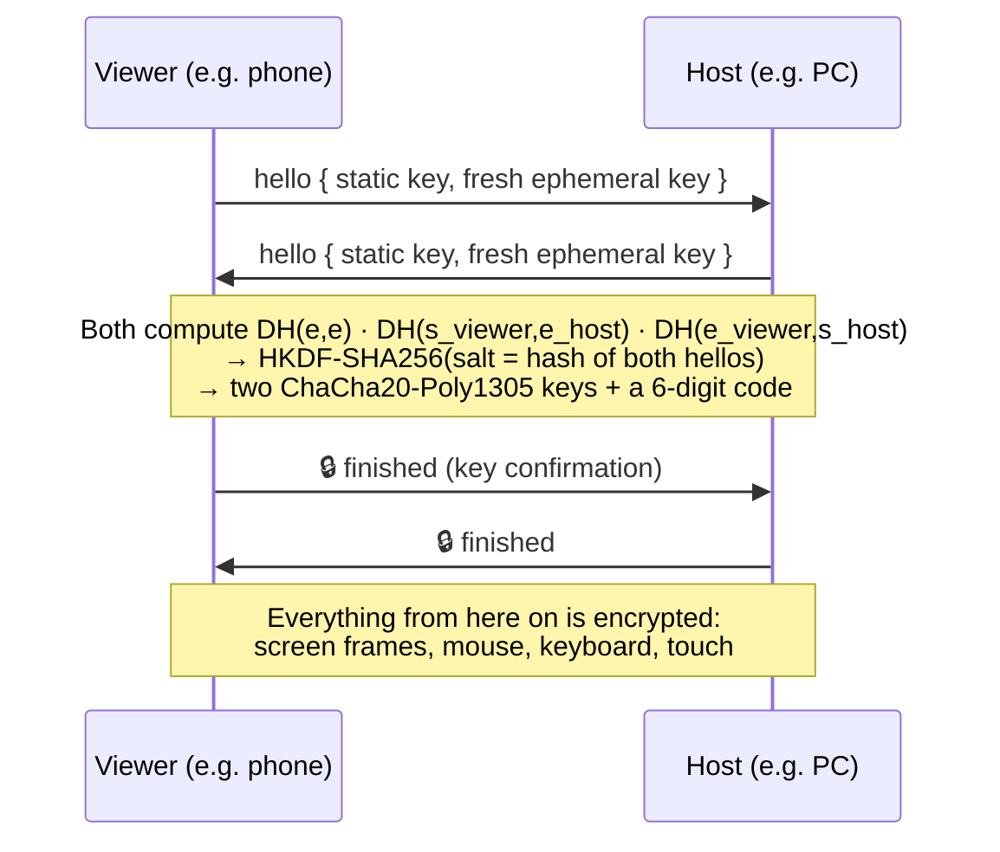

# Security

PixMirror can see your screen and control your PC or phone, so security is part of the design.
This page explains how PixMirror protects you, what it does **not** protect against, and how to report a problem.

<p align="center">
  
</p>

The image above comes from [`test/security_test.dart`](test/security_test.dart), which runs real attacks against the real host server over sockets.
To reproduce it:

```bash
flutter test test/security_test.dart
dart compile exe tools/bench_crypto.dart -o build/bench_crypto.exe
build/bench_crypto.exe
python tools/make_security_chart.py
```

## Supported versions

| Version | Supported |
|---|---|
| 1.1.x (protocol v2, encrypted) | ✅ |
| 1.0.0 (protocol v1, unencrypted) | ❌ Please upgrade. v1 devices can't connect to v2. |

## How PixMirror protects you

### 1. Every device has a cryptographic identity

On first launch each device generates an **X25519 key pair**. The private key never leaves the device. It is stored in the OS-protected store:
- **Android:** an AES-256-GCM key in the Android Keystore, hardware-backed (TEE / StrongBox) on most phones.
- **Windows:** DPAPI, bound to your Windows user account.

The device ID shown on the network is a **fingerprint of the public key**. Nobody can claim to be your phone without holding your phone's private key.

### 2. Every connection is encrypted and mutually authenticated

The handshake works like the [Noise protocol framework](https://noiseprotocol.org/):



| Property | How |
|---|---|
| **Confidentiality** | ChaCha20-Poly1305 encrypts every message and every screen frame |
| **Integrity** | The Poly1305 tag on every message. One flipped bit closes the session |
| **Replay protection** | A per-direction 64-bit counter is used as the nonce. A replayed or reordered message fails to decrypt |
| **Mutual authentication** | Each side mixes its *static* key into the handshake. Without the private key, the session keys come out wrong |
| **Forward secrecy** | Fresh ephemeral keys for every session. A stolen identity key can't decrypt traffic recorded earlier |
| **Downgrade resistance** | Plaintext or v1 clients are refused. There is no fallback |

### 3. Pairing never sends a secret over the network

The 6-digit code you compare during pairing isn't sent; it is **derived from the handshake**. If someone is in the middle, the two screens show **different** codes. This is the same idea as Bluetooth's *numeric comparison*.

When you tap **Allow**, each device stores (*pins*) the other's **public key**. Later connections are checked against that pinned key:
- If a device presents a different key, the viewer stops with a security warning.
- If a device announces the right name from a different address, the viewer also stops.

### 4. Hardening

- **LAN only.** The host refuses connections that don't come from a private, link-local or loopback address. Discovery ignores beacons from anywhere else.
- **Rate limits:**
  - 20 connections per minute per address
  - 4 pairing prompts per 10 minutes, so a device can't spam you with "wants to connect" popups
  - a 10-minute lockout after 5 failed handshakes
- **Size limits.** Hosts accept at most 64 KB per message, handshake messages are limited to 2 KB, and discovery beacons to 1 KB.
- **Strict input validation.** Every remote input is checked against an allow-list before it reaches Windows or Android:
  - coordinates are clamped to the screen
  - key names and modifiers are allow-listed
  - text is length-limited and control characters are stripped
  - input meant for the other platform is dropped
- **No input before approval.** An unpaired or unapproved device can't move the pointer or type.
- **Visible sessions.** The host always shows who is connected and has a **Disconnect** button. Android also shows the system screen-sharing indicator and a persistent notification.

### 5. Platform safeguards

- **Android** asks for screen-capture consent each time sharing starts. Remote control needs an Accessibility service that you turn on yourself.
- **Windows** blocks injected input into apps running **as administrator** and on the **lock / UAC screens**, so a remote viewer can't approve UAC prompts.

## Test results

| # | Attack scenario | Result |
|---|---|---|
| 1 | Downgrade to an unencrypted protocol | ✅ Blocked |
| 2 | Pairing codes differ between devices (no MITM) | ✅ Identical |
| 3 | Man-in-the-middle relay between phone and PC | ✅ Detected: codes differ and the identity doesn't match |
| 4 | Spoofing a trusted phone without its private key | ✅ Blocked |
| 5 | Modifying traffic in transit (bit flip) | ✅ Session closed |
| 6 | Replaying captured traffic | ✅ Rejected |
| 7 | Unknown device typing or clicking before approval | ✅ No input applied |
| 8 | Oversized message (memory exhaustion) | ✅ Rejected |
| 9 | 400 fuzzed or malformed input messages | ✅ Only sanitized input reached the OS, and the host stayed up |
| 10 | Pairing-prompt flood | ✅ Rate-limited |
| 11 | Repeated malformed handshakes | ✅ Address locked out |
| 12 | Connections from Internet addresses | ✅ Refused |
| 13 | Decrypting recorded traffic after a key leak | ✅ Fresh keys per session |

**Performance on this PC (Windows 11, Dart 3.13):**
- **Handshake:** about 10–20 ms median, depending on load.
- **Encryption:** about 4.8 ms to encrypt and decrypt a 100 KB frame in a compiled (AOT) release build. That is well inside the 33 ms budget for 30 fps.

## What PixMirror does *not* protect against

- **A compromised device.** Malware already running on your PC or phone with your privileges can read your screen anyway.
- **Someone with your unlocked device** can approve a pairing request.
- **Not comparing the code.** If you tap *Allow* without checking that the 6-digit codes match, a nearby attacker *could* pair during that one window. Always compare the codes.
- **Traffic analysis.** Someone on your network can see *that* two devices are talking and roughly how much, but not what.
- **Unsigned builds.** The release APK uses a development signing key and the Windows build isn't code-signed, so verify that you downloaded it from this repository's Releases page.

## Reporting a vulnerability

Please **don't open a public issue** for security problems. Use GitHub's private advisory instead: **Security → Report a vulnerability** on this repository.

Please include:
- steps to reproduce
- affected versions
- the impact

You'll get a reply within 7 days. Fixes are credited in the release notes unless you prefer otherwise.
