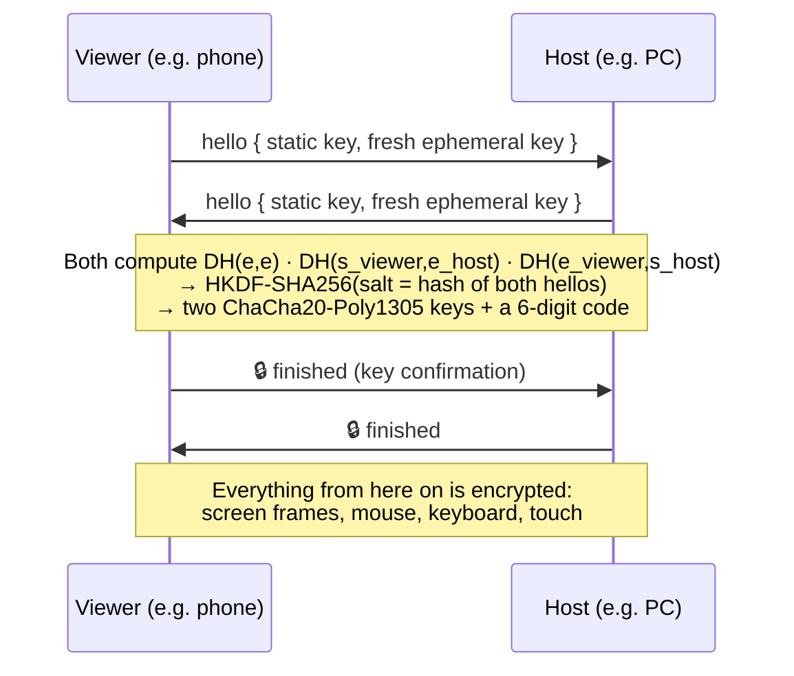

# Security

PixMirror can see your screen and control your PC or phone, so security is part of the design.
This page explains how PixMirror protects you, what it does **not** protect against, and how to report a problem.

<p align="center">
  
</p>

The image above comes from [`test/security_test.dart`](test/security_test.dart): **20 security tests**, all passing.
- **Runtime** tests run real attacks over sockets against the real host server, discovery and viewer code.
- **Static** tests audit the Android manifest and the source tree.
- **Live** checks also probe a running `pixmirror.exe`.
- The dependency scan queries the public [OSV](https://osv.dev) vulnerability database.

To reproduce it:

```bash
flutter test test/security_test.dart
dart compile exe tools/bench_crypto.dart -o build/bench_crypto.exe
build/bench_crypto.exe
python tools/make_security_chart.py
```

## Supported versions

| Version | Supported |
|---|---|
| 1.1.x (protocol v2, encrypted) | ✅ |
| 1.0.0 (protocol v1, unencrypted) | ❌ Please upgrade. v1 devices can't connect to v2. |

## How PixMirror protects you

### 1. Every device has a cryptographic identity

On first launch each device generates an **X25519 key pair**. The private key never leaves the device. It is stored in the OS-protected store:
- **Android:** an AES-256-GCM key in the Android Keystore, hardware-backed (TEE / StrongBox) on most phones.
- **Windows:** DPAPI, bound to your Windows user account.

The device ID shown on the network is a **fingerprint of the public key**. Nobody can claim to be your phone without holding your phone's private key.

### 2. Every connection is encrypted and mutually authenticated

The handshake works like the [Noise protocol framework](https://noiseprotocol.org/):



| Property | How |
|---|---|
| **Confidentiality** | ChaCha20-Poly1305 encrypts every message and every screen frame |
| **Integrity** | The Poly1305 tag on every message. One flipped bit closes the session |
| **Replay protection** | A per-direction 64-bit counter is used as the nonce. A replayed or reordered message fails to decrypt |
| **Mutual authentication** | Each side mixes its *static* key into the handshake. Without the private key, the session keys come out wrong |
| **Forward secrecy** | Fresh ephemeral keys for every session. A stolen identity key can't decrypt traffic recorded earlier |
| **Downgrade resistance** | Plaintext or v1 clients are refused. There is no fallback |

### 3. Pairing never sends a secret over the network

The 6-digit code you compare during pairing isn't sent; it is **derived from the handshake**. If someone is in the middle, the two screens show **different** codes. This is the same idea as Bluetooth's *numeric comparison*.

When you tap **Allow**, each device stores (*pins*) the other's **public key**. Later connections are checked against that pinned key:
- If a device presents a different key, the viewer stops with a security warning.
- If a device announces the right name from a different address, the viewer also stops.

### 4. Hardening

- **LAN only.** The host refuses connections that don't come from a private, link-local or loopback address. Discovery ignores beacons from anywhere else.
- **Rate limits:**
  - 20 connections per minute per address
  - 4 pairing prompts per 10 minutes, so a device can't spam you with "wants to connect" popups
  - a 10-minute lockout after 5 failed handshakes
- **Size limits.** Hosts accept at most 64 KB per message, handshake messages are limited to 2 KB, and discovery beacons to 1 KB.
- **Strict input validation.** Every remote input is checked against an allow-list before it reaches Windows or Android:
  - coordinates are clamped to the screen
  - key names and modifiers are allow-listed
  - text is length-limited and control characters are stripped
  - input meant for the other platform is dropped
- **No input before approval.** An unpaired or unapproved device can't move the pointer or type.
- **Visible sessions.** The host always shows who is connected and has a **Disconnect** button. Android also shows the system screen-sharing indicator and a persistent notification.

### 5. Platform safeguards

- **Android** asks for screen-capture consent each time sharing starts. Remote control needs an Accessibility service that you turn on yourself.
- **Windows** blocks injected input into apps running **as administrator** and on the **lock / UAC screens**, so a remote viewer can't approve UAC prompts.

## Test results

20/20 passed on 2026-10-02 ("Windows 11 Home" 10.0 (Build 26200), Dart 3.13.4).

| # | Test | How | Attack / risk | Result |
|---|---|---|---|---|
| 1 | Pairing brute-force resistance | runtime | Guessing or spamming the 6-digit pairing code | ✅ code changes every handshake; no code-entry endpoint; 3/7 extra attempts rate-limited |
| 2 | Man-in-the-middle (MITM) | runtime | Attacker relaying between phone and PC | ✅ codes differ (299872 vs 965923) and the relay's identity does not match the PC |
| 3 | Replay attack | runtime | Re-sending captured traffic | ✅ replayed ciphertext rejected, session closed |
| 4 | Packet tampering | runtime | Flipping bits in ciphertext or auth tag | ✅ 3/3 bit-flips (start, middle, tag) rejected |
| 5 | Malformed packet fuzzing | runtime | Random binary / text packets after the handshake | ✅ 40 random packets: every session dropped cleanly, host kept serving |
| 6 | Oversized packet / memory exhaustion | runtime | 200 KB input message, 3 MB pre-auth blob | ✅ hosts accept at most 64 KB per message; both dropped |
| 7 | Authentication bypass | runtime | Skipping key confirmation / forging the handshake | ✅ 3 bypass attempts: all closed, zero input reached the OS |
| 8 | Protocol downgrade | runtime | Forcing the old unencrypted v1 protocol | ✅ 5/5 non-v2 hellos refused, no fallback |
| 9 | Key-pinning validation | runtime | A device impersonating a paired PC or phone | ✅ host re-prompts for an unknown key; viewer stops with a security warning on a key mismatch |
| 10 | Session isolation | runtime | Second device hijacking or splicing into a session | ✅ one viewer at a time; ciphertext from one session is rejected by another |
| 11 | Disconnect / reconnect security | runtime | Stale sessions or key reuse after a drop | ✅ session released on disconnect; reconnect re-authenticates with fresh keys |
| 12 | Forward secrecy | runtime | Decrypting recorded traffic after a key leak | ✅ ephemeral X25519 per session: same identities, same plaintext, different ciphertext |
| 13 | Network discovery privacy | runtime | What the Wi-Fi beacon leaks; spoofed beacons | ✅ beacon = 6 fields, 101 bytes, no keys; 7 hostile beacons dropped, control chars stripped |
| 14 | Port exposure | runtime + live | Extra services, HTTP probing, WAN access | ✅ only /ws upgrades (other paths 404, no Server header); WAN 403; live app (pid 30820) listens on 47801 + 47800 only |
| 15 | Android Accessibility authorization | static | Other apps driving the accessibility service | ✅ service bound by BIND_ACCESSIBILITY_SERVICE, not exported; only MainActivity drives it; input sanitised in live sessions |
| 16 | Windows SendInput authorization | runtime | Injecting mouse/keys before or after approval | ✅ 0 inputs while declined / waiting / disconnected; live input clamped & allow-listed; SendInput reachable from one place |
| 17 | Clipboard data leakage | static | Clipboard contents silently sent to the other device | ✅ no clipboard API in Dart, Kotlin or C++; no clipboard message in the protocol |
| 18 | Protocol parser fuzzing | runtime | Crashing the handshake, decoders or input guard | ✅ 150 hostile hellos + 10k decoder inputs + 10k input-guard messages: 0 crashes |
| 19 | Dependency & secret scanning | runtime + OSV | Leaked keys in the repo; vulnerable packages | ✅ 82 tracked files: no secrets; 17 packages checked against OSV: 0 vulnerable |
| 20 | End-to-end security regression | runtime + live | The whole lifecycle, start to finish | ✅ 8/8 lifecycle steps pass (incl. the running app) |

What the tests can't reach on a desktop CI machine is labelled honestly:
- **Test 15 (static):** checks the Android manifest and code paths, not a running phone.
- **Test 16:** checks every authorization state that leads to `SendInput`, but doesn't inject real keystrokes into your desktop.
- **Tests 14 and 20:** add their live checks only when `pixmirror.exe` is running.

### Performance

- **Handshake:** 11.9 ms median, 14.5 ms p95, including mutual authentication.
- **Encryption:** 4.7 ms to encrypt and decrypt a 100 KB frame in a compiled (AOT) release build. That's well inside the 33 ms budget for 30 fps.
- **Encrypted stream:** 29.7 fps against a 30 fps target, with 100 KB frames over loopback.
- **Dependencies:** 17 hosted packages checked against OSV, with 0 known vulnerabilities.

## What PixMirror does *not* protect against

- **A compromised device.** Malware already running on your PC or phone with your privileges can read your screen anyway.
- **Someone with your unlocked device** can approve a pairing request.
- **Not comparing the code.** If you tap *Allow* without checking that the 6-digit codes match, a nearby attacker *could* pair during that one window. Always compare the codes.
- **Traffic analysis.** Someone on your network can see *that* two devices are talking and roughly how much, but not what.
- **Unsigned builds.** The release APK uses a development signing key and the Windows build isn't code-signed, so verify that you downloaded it from this repository's Releases page.

## Reporting a vulnerability

Please **don't open a public issue** for security problems. Use GitHub's private advisory instead: **Security → Report a vulnerability** on this repository.

Please include:
- steps to reproduce
- affected versions
- the impact

You'll get a reply within 7 days. Fixes are credited in the release notes unless you prefer otherwise.
